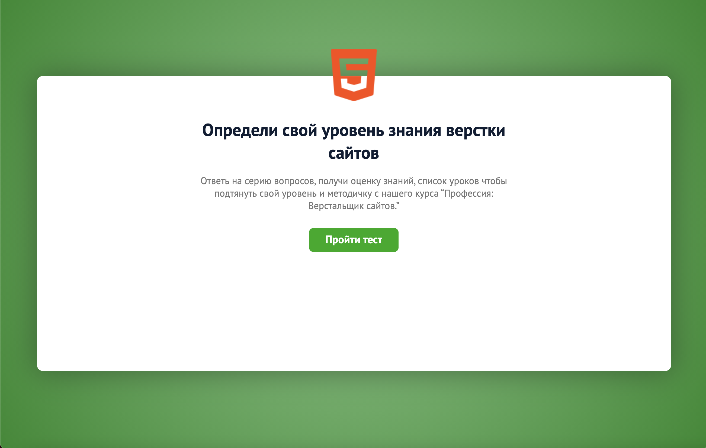

# Quiz project on _pure JS_

## What is done:

* Bootstrap and JavaScript
* Functionality of moving on cards, forward and backward
* Check for data entry (validate)
* Receiving (collecting) data from cards
* Record all entered data
* Implementation of the progress bar
* Highlighting the frame for radio and checkboxes

